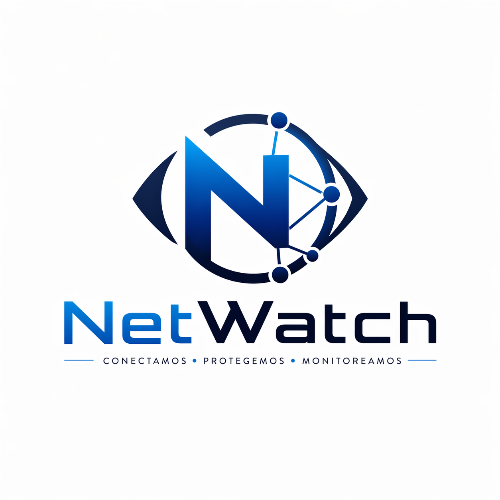
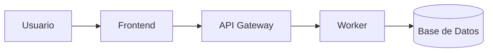

# 🚀 Guía de Inicio Rápido — NetWatch

<p align="center">
  
</p>

## Esta guía te lleva desde cero hasta tener NetWatch funcionando en tu computador, paso a paso, sin conocimientos técnicos previos. ##

**Tiempo estimado:** 15-20 minutos (la mayor parte es espera mientras descarga)

---
## 🧠 ¿Qué es NetWatch?

NetWatch es una aplicación que monitorea tu red en tiempo real y te avisa cuando detecta actividad sospechosa, como intentos de fuerza bruta, escaneo de puertos o comportamientos anómalos.  
Toda la información se visualiza en un panel web accesible desde el navegador.

## 📐 ¿Cómo funciona NetWatch?

El sistema está basado en una arquitectura de microservicios:




# 🚀 PASOS 

## 📦 Paso 1 — Instalar Docker

Docker es el programa que ejecuta NetWatch. Sin él no funciona nada.


| Sistema operativo | Cómo instalarlo |
|---|---|
| **Windows 10/11** | Descarga e instala [Docker Desktop para Windows](https://docs.docker.com/desktop/install/windows-install/). Durante la instalación acepta activar WSL 2 si te lo pide. |
| **macOS** | Descarga e instala [Docker Desktop para Mac](https://docs.docker.com/desktop/install/mac-install/) |
| **Ubuntu / Debian / MX Linux** | Abre una terminal y ejecuta: `curl -fsSL https://get.docker.com \| sh && sudo usermod -aG docker $USER`    — luego cierra sesión y vuelve a entrar |

**¿Cómo verificar que Docker está instalado?**

Abre una terminal y escribe:
```
docker --version
```
Deberías ver algo como: `Docker version 26.x.x`. Si lo ves, Docker está listo.

---

## ▶️ 2. La terminal correcta según tu sistema

Los comandos de esta guía usan `make`, que **no funciona en el CMD ni en PowerShell de Windows**. Usa la terminal correcta:

| Sistema | Terminal que debes usar |
|---|---|
| **Windows** | **Git Bash** — se instala junto con [Git para Windows](https://git-scm.com/downloads). Búscala en el menú inicio como "Git Bash" y ábrela. |
| **macOS** | Terminal normal (viene incluida) |
| **Linux** | Terminal normal |

> **¿Cómo abrir Git Bash en Windows?**
> 1. Presiona la tecla Windows
> 2. Escribe `Git Bash`
> 3. Haz clic en el resultado que aparece
> 4. Se abre una ventana negra con el símbolo `$` — ahí escribes los comandos

---

## ▶️ Paso 1 — Descargar NetWatch

Abre tu terminal (Git Bash en Windows, Terminal en Mac/Linux) y copia estas dos líneas, **una por una**, presionando Enter después de cada una:

```bash
git clone https://github.com/AlexGarzonSoto/MonitoreoRedInfra.git
cd MonitoreoRedInfra
```

Cuando termines, habrás descargado el proyecto en una carpeta llamada `MonitoreoRedInfra` y estarás dentro de ella.

> **¿No tienes git?** En Windows se instala junto con Git Bash (enlace arriba). En Linux: `sudo apt install git`

---

## ▶️ Paso 2 — Configurar (solo la primera vez)

Dentro de la carpeta del proyecto, ejecuta:

```bash
make configurar
```

Este comando hace dos cosas automáticamente:
- Crea el archivo de configuración con todos los valores necesarios
- Genera claves de seguridad únicas para tu instalación

**Deberías ver al final:**
```
✓ Archivo .env creado con claves de seguridad generadas automáticamente
✓ Configuración lista.

  Próximo paso:
    make iniciar
```

### >> ⚠️ Nota: Si ves un error que dice "Docker no está instalado", asegúrate de que Docker Desktop esté **abierto y ejecutándose** (en Windows/Mac verás el ícono de ballena en la barra de tareas).

---

## ▶️ Paso 3 — Arrancar NetWatch

```bash
make iniciar
```

**La primera vez** este proceso descarga las imágenes pre-construidas desde Docker Hub. Dependiendo de tu conexión puede tardar entre 2 y 5 minutos. Las veces siguientes será mucho más rápido (menos de 1 minuto).

Verás muchas líneas de texto pasando — eso es normal. Cuando termine verás:

```
✓ NetWatch arrancado.

  Espera 2 minutos y luego accede a:
    Dashboard:  http://localhost:3000
```

**Espera 2 minutos** para que todos los servicios internos terminen de arrancar.

---

## ▶️ Paso 4 — Abrir el panel de control

Abre tu navegador (Chrome, Firefox, Edge) y ve a:

```
http://localhost:3000
```

Verás la pantalla de inicio de sesión de NetWatch.

**Credenciales iniciales:**

| Campo | Valor |
|---|---|
| Usuario | `admin@netwatch.local` |
| Contraseña | `NetWatch2024!` |

---

## ▶️ Lo que verás al entrar

Una vez dentro del panel verás:

- **Dashboard**: resumen con el número de amenazas detectadas, alertas activas y eventos recientes
- **Eventos**: tabla con cada paquete de red analizado y su clasificación
- **Alertas**: notificaciones de amenazas que requieren atención
- **Gráficas**: distribución de tipos de amenaza en el tiempo

Los datos empiezan a aparecer en los primeros minutos porque NetWatch genera tráfico de prueba automáticamente.

---

## ▶️ Comandos del día a día

Una vez que tienes NetWatch instalado, estos son los únicos comandos que necesitas (ejecutados desde la carpeta `MonitoreoRedInfra` en tu terminal):

| Qué quieres hacer | Comando |
|---|---|
| Arrancar NetWatch | `make iniciar` |
| Parar NetWatch | `make detener` |
| Ver si todo funciona | `make estado` |
| Ver mensajes internos (para diagnóstico) | `make logs` |
| Ver todos los comandos disponibles | `make` |

---

## ▶️ Solución de problemas frecuentes

### ▶️ "El comando make no se reconoce"

Estás usando CMD o PowerShell de Windows. Cierra esa ventana y abre **Git Bash** en su lugar (busca "Git Bash" en el menú inicio).

---

### ▶️ "No puedo abrir http://localhost:3000"

NetWatch puede tardar hasta 3 minutos en estar completamente listo. Espera un poco y recarga la página. Si sigue sin funcionar, ejecuta en tu terminal:

```bash
make estado
```

Revisa que todos los servicios aparezcan como `running` o `healthy`. Si alguno dice `exited`, ejecuta `make logs` para ver qué ocurrió.

---

### ▶️ "Docker Desktop no arranca en Windows"

Docker Desktop en Windows requiere que WSL 2 esté activado. Si no lo tienes:

1. Abre PowerShell **como administrador**
2. Ejecuta: `wsl --install`
3. Reinicia el computador
4. Vuelve a abrir Docker Desktop

---

### ▶️ "Veo muchos errores en la terminal al iniciar"

### >> ⚠️ Los primeros 2 minutos es normal ver mensajes de error mientras los servicios se conectan entre sí. Si después de 5 minutos el panel sigue sin abrir, ejecuta:

```bash
make logs
```

Busca líneas que digan `ERROR` en mayúsculas y comparte esos mensajes si necesitas ayuda.

---

### ▶️ "Olvidé la contraseña de administrador"

Las credenciales iniciales siempre son:
- Usuario: `admin@netwatch.local`
- Contraseña: `NetWatch2024!`

Si las cambiaste y las olvidaste, ejecuta:

```bash
make limpiar
make configurar
make iniciar
```

> **Advertencia:** `make limpiar` borra todos los datos guardados (eventos, alertas, historial).

---

### ▶️ "Quiero parar NetWatch para no consumir recursos"

```bash
make detener
```

Esto para todos los servicios pero conserva todos tus datos. La próxima vez que ejecutes `make iniciar` todo estará exactamente como lo dejaste.

---

# ▶️ Para las personas más curiosas

Si quieres entender en detalle cómo funciona NetWatch por dentro, los manuales técnicos están en la carpeta `docs/`:

| Manual | Contenido |
|---|---|
| [Manual de Usuario](user-manual.md) | Cómo usar cada función del dashboard |
| [Manual de Desarrollo](development-manual.md) | Cómo modificar el código fuente |
| [Manual de Despliegue](deployment-manual.md) | Instalación avanzada en servidores |
| [Manual de Seguridad](security-manual.md) | Análisis de amenazas y controles |

---

# ▶️ ¿Algo no funcionó?

Abre un issue en el repositorio del proyecto:
[github.com/AlexGarzonSoto/MonitoreoRedInfra/issues](https://github.com/AlexGarzonSoto/MonitoreoRedInfra/issues)

Incluye la salida del comando `make estado` y las últimas líneas de `make logs`.
